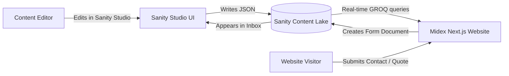

# MIDEX Sanity Studio CMS — Complete Reference & Editor Guide

> **Audience:** Content Managers, Editors, Developers, and Stakeholders.  
> **Purpose:** A comprehensive, field-by-field reference explaining every section, document type, field structure, and workflow inside the **Midex Sanity Studio CMS**.

---

## Table of Contents

1. [Architectural Overview](#1-architectural-overview)
2. [Global Content Concepts & Primitives](#2-global-content-concepts--primitives)
   - [2.1 Multilingual Localization (`en`, `ar`, `de`)](#21-multilingual-localization-en-ar-de)
   - [2.2 Image Pipeline & Smart Focal Points (`imageWithAlt`)](#22-image-pipeline--smart-focal-points-imagewithalt)
   - [2.3 Documents vs. Objects](#23-documents-vs-objects)
   - [2.4 Singletons vs. Collections](#24-singletons-vs-collections)
   - [2.5 Publishing Workflow & Live Drafts](#25-publishing-workflow--live-drafts)
3. [Dashboard Sidebar Breakdown (Section-by-Section)](#3-dashboard-sidebar-breakdown-section-by-section)
   - [Section 1: 📩 Inbox (Form Submissions)](#section-1--inbox-form-submissions)
   - [Section 2: ⚙️ Site (Settings, UI Messages & Redirects)](#section-2-️-site-settings-ui-messages--redirects)
   - [Section 3: 🏠 Pages (Page-Level Singletons)](#section-3--pages-page-level-singletons)
   - [Section 4: 🔧 Solutions (Engineering Groups & Services)](#section-4--solutions-engineering-groups--services)
   - [Section 5: 📦 Products (Categories & Products Catalog)](#section-5--products-categories--products-catalog)
   - [Section 6: 📝 Blog (Articles & Authors)](#section-6--blog-articles--authors)
   - [Section 7: ✨ Marketing (Modular Content Blocks)](#section-7--marketing-modular-content-blocks)
   - [Section 8: 👥 People & Brands (Founders, Partners, Logos & Certs)](#section-8--people--brands-founders-partners-logos--certs)
   - [Section 9: 🔍 SEO (Search Engine Optimization)](#section-9--seo-search-engine-optimization)
4. [Reusable Object Schemas Reference](#4-reusable-object-schemas-reference)
5. [Editor Best Practices & Operational Checklist](#5-editor-best-practices--operational-checklist)

---

## 1. Architectural Overview

**Sanity CMS** operates as a **Headless Content Management System**:
* **Content Lake (Backend):** A real-time, global JSON cloud database storing all published and draft documents.
* **Sanity Studio (Control Panel):** A single-page application built on top of React, structured specifically to model Midex's industrial and engineering catalog.
* **Frontend (Next.js Application):** Consumes structured JSON via **GROQ** (Graph-Relational Object Queries) and renders high-performance, SEO-optimized web pages.



---

## 2. Global Content Concepts & Primitives

### 2.1 Multilingual Localization (`en`, `ar`, `de`)
Midex is a global multi-language industrial platform supporting **English (`en`)**, **Arabic (`ar`)**, and **German (`de`)**.

Instead of duplicating entire pages for each language, Midex uses **Field-Level Localization**:
* **`localeString`**: Short single-line text available in `en`, `ar`, and `de`.
* **`localeText`**: Multi-line paragraphs available in `en`, `ar`, and `de`.
* **`localeStringList`**: Array of bullet points or feature highlights translated per language.

> **Editor Rule:** Always fill in at least the **English** and **Arabic** translations. If a German translation is missing, the system gracefully falls back to English.

---

### 2.2 Image Pipeline & Smart Focal Points (`imageWithAlt`)
Every image field in the studio uses a unified, custom type: `imageWithAlt`.

* **Hotspot & Crop Tool:** Clicking **Edit** on any uploaded image opens the hotspot tool. Moving the blue circle to the most critical part (e.g., product valve, person's face) guarantees the image is never cropped awkwardly across mobile phones, tablets, or widescreen monitors.
* **Localized Alt Text (`alt`):** An accessible description of the image in `en`, `ar`, and `de` for screen readers and search engines.
* **Asset Optimization:** Uploading a high-resolution PNG or JPG automatically produces optimized WebP/AVIF formats at the exact screen size needed.

---

### 2.3 Documents vs. Objects
* **Document (`type: "document"`):** Has a dedicated ID (`_id`), history timeline, publishing state, and appears in listing views. (e.g., a *Product*, a *Blog Post*, or *Site Settings*).
* **Object (`type: "object"`):** A reusable component nested inside a document. It does not exist independently. (e.g., an individual *FAQ Item*, a *Metric Row*, or an *Image with Alt*).

---

### 2.4 Singletons vs. Collections
* **Singleton Documents:** Unique, one-off documents where there can only ever be **one** instance (e.g., *Homepage*, *About Page*, *Site Settings*). The Studio disables "Create New" or "Delete" for these.
* **Collection Documents:** Document tables where you can add, delete, and duplicate infinite records (e.g., *Products*, *Testimonials*, *Case Studies*).

---

### 2.5 Publishing Workflow & Live Drafts
* **Automatic Drafts:** Every keystroke and image upload is saved in real time as a private draft.
* **Publish Button:** Green button at the bottom right. Pushing changes makes them instantly live on the website.
* **Discard Changes:** Reverts any unpublished edits back to the currently live version.

---

## 3. Dashboard Sidebar Breakdown (Section-by-Section)

Here is the exhaustive, field-by-field guide to the **9 main sections** on the Midex Studio sidebar:

```
├── 📩 Inbox
├── ⚙️ Site
├── 🏠 Pages
├── 🔧 Solutions
├── 📦 Products
├── 📝 Blog
├── ✨ Marketing
├── 👥 People & Brands
└── 🔍 SEO
```

---

### Section 1: 📩 Inbox (Form Submissions)

All inbound client requests from the website forms arrive here in real time.

#### Document: `Form Submission` (`formSubmission`)
* **Group: Meta**
  * `Status` (`status`): Radio selector (`New`, `Read`, `Archived`). Use this to triage sales leads.
  * `Form` (`source`): Read-only identifier indicating whether the submission came from the `Contact page` or the `Quote form`.
  * `Submitted At` (`submittedAt`): Exact timestamp of form submission.
  * `Locale` (`locale`): The language version the user was browsing when submitting (`en`, `ar`, `de`).
* **Group: Contact**
  * `Full Name` (`name`): Lead’s full name.
  * `Email Address` (`email`): Lead’s email address.
  * `Phone Number` (`phone`): Direct phone or WhatsApp number.
  * `Company` (`company`): Customer's organization or factory name.
  * `Job Title` (`jobTitle`): Professional role of the requester.
* **Group: Message**
  * `Service / Inquiry Type` (`service`): The specific service or product category selected.
  * `Message` (`message`): The inquiry or project brief.
  * `Quote Details` (`quoteDetails`): Machine specs, capacity requirements, or raw material details (if submitted via Quote form).

---

### Section 2: ⚙️ Site (Settings, UI Messages & Redirects)

Global configurations that govern website-wide branding, headers, footers, and URL rules.

#### 1. `Site Settings` (`siteSettings` — Singleton)
Organized into 6 administrative tabs:
* **Identity:**
  * `Site Name` (`name`): The public brand name ("MIDEX").
  * `Legal Name` (`legalName`): The registered commercial entity name.
  * `Logo (Dark)` (`logoDark`): Dark version of the company logo (used on light backgrounds).
  * `Logo (White)` (`logoWhite`): White/light logo (used over dark heroes or footers).
* **Contact:**
  * `Email` (`email`): Official public email address.
  * `Phone Numbers` (`phones`): List of company phone lines.
  * `Address` (`address`): Complete multi-line physical address.
  * `Street / City / Region / Postal Code / Country`: Granular address fields used for Schema.org SEO rich snippets.
  * `Google Maps URL` (`mapsUrl`): External link opening Google Maps.
  * `Google Maps Embed URL` (`mapsEmbedUrl`): `<iframe>` embed source for the contact page map.
* **Social:**
  * `LinkedIn URL`, `Facebook URL`, `YouTube URL`, `WhatsApp URL`.
* **Nav & Footer (`chrome`):**
  * Navigation links, quick links, footer copyright, and language switchers.
* **Manifest & Robots (`manifest`):**
  * Web app theme colors, PWA background colors, and `Robots Disallow` paths for search bot crawling.
* **Promo Popup (`promo`):**
  * `Promotional Popup` (`promoPopup`): Global modal overlay to announce trade fairs, new product launches, or seasonal greetings.

#### 2. `UI Messages` (`uiMessages` — Grouped by Area)
Translates hardcoded interface labels across 3 languages:
* **Chrome & Layout:** Navigation labels, footer headers, search placeholders, cookie banners.
* **Forms (Contact & Quote):** Input field placeholders, validation error notices, success alert text.
* **Pages:** Filter dropdown text, "Load More" buttons, "Request a Quote" buttons.

#### 3. `Redirects` (`redirect`)
* `Source Path` (`source`): The legacy URL path (e.g. `/old-products/mixer`).
* `Destination Path` (`destination`): The new target URL (e.g. `/en/products/industrial-mixer`).
* `Permanent (308)` (`permanent`): Boolean toggle ensuring search engines permanently transfer SEO ranking authority.

---

### Section 3: 🏠 Pages (Page-Level Singletons)

Each major landing page has a dedicated singleton document structured with tabs:

#### 1. `Homepage` (`homePage`)
* **Hero Media (`media`):** Background video URLs, fallback hero images, and carousel graphics.
* **Hero Copy (`hero`):** Main slide headline (`slide1Title`), supporting paragraph (`slide1Text`), Primary CTA ("Request Quote"), Secondary CTA ("View Products").
* **Section Headers & Content Tabs:**
  * `Partners` (`partners`): Header and toggle for featured partners.
  * `Featured Quote` (`quote`): Executive quote with name, title, and portrait.
  * `Capabilities` (`capabilities`): 4-card grid highlighting engineering strengths.
  * `Truvia Promo` (`truvia`): Specialized product highlight banner.
  * `Before / After` (`beforeAfter`): Interactive comparison slider component.
  * `Statistics`, `Events`, `Products`, `Case Studies`, `Testimonials`, `FAQ`.
* **Bottom CTA & Section Order (`cta`):**
  * `Section Order` (`sectionOrder`): An array selector that allows editors to **reorder the entire homepage sections vertically** (e.g., move Testimonials above Products) without touching code!

#### 2. `About Page` (`aboutPage`)
* **Hero:** Header copy, badge, and key metrics (`heroMetricsBlock` showing years in business, team size, etc.).
* **Mission & Vision (`mission`):** Dual-block cards for corporate mission, vision, and core purpose.
* **Milestones (`milestones`):** Intro text for the company historical timeline.
* **Standards (`standards`):** Quality management standards and operational principles.
* **Values (`values`):** Core corporate values.
* **Certifications, Events, FAQ, CTA.**

#### 3. `Contact Page` (`contactPage`)
* Hero copy and background media.
* Branch offices and customer service dispatch channels.
* Contact form copy overrides.

#### 4. `Products Page` (`productsPage`)
* Catalog banner, category navigation labels, and search bar copy.

#### 5. `Solutions Page` (`solutionsPage`)
* Engineering capabilities header, solution group overviews, and consultation CTAs.

#### 6. `Blog Page` (`blogPage`) & `Case Studies Page` (`caseStudiesPage`)
* Index heroes, topic filter tags, and lead capture banners.

---

### Section 4: 🔧 Solutions (Engineering Groups & Services)

Midex organizes complex engineering services into a two-tier hierarchy:

#### 1. `Solution Groups` (`solutionGroup`)
Top-level industrial domains (e.g., *Automation & Control*, *Steel Fabrication*).
* `Title` (`title`): Localized name (`localeString`).
* `Slug` (`slug`): URL identifier.
* `Description` (`description`): Localized overview.
* `Icon / Image`: Visual identifier.
* `Order` (`order`): Integer sequence for sorting.

#### 2. `Solution Services` (`solutionChild`)
Specific engineering service pages under a group.
* `Title`, `Slug`, `Category Reference` (`solutionGroup` link).
* `Hero & Excerpt`: Summary text for cards and header.
* `Specifications` (`specs`): Array of key-value technical parameters.
* `Workflow Steps` (`workflowSteps`): Step-by-step diagram cards (Step 1: Engineering -> Step 2: Fabrication -> Step 3: Installation).
* `Before / After Content`: Interactive slider showcasing past project transformations.
* `Service FAQs`: Specific accordion questions answered for this service.

---

### Section 5: 📦 Products (Categories & Products Catalog)

#### 1. `Product Categories` (`productCategory`)
* `Label` (`label`): Localized category title (e.g., *Extrusion Lines*).
* `Slug` (`slug`): URL path segment.
* `Description` (`description`): Localized description.
* `Cover Image` (`image`): Category card picture.
* `Default Specs Template` (`specs`): Baseline technical specification fields inherited by products in this category.

#### 2. `Products` (`product`)
* **Content Tab:**
  * `Title` (`title`): Product commercial name.
  * `Slug` (`slug`): Unique URL identifier.
  * `Category` (`category`): Reference linking to parent `productCategory`.
  * `Subcategory` (`subcategory`): Localized sub-tier tag.
  * `Excerpt` & `Description`: Short summary and full technical description.
  * `Order` (`order`): Sorting priority in the catalog.
* **Media Tab:**
  * `Main Image` (`image`): High-resolution featured picture with hotspot.
  * `Gallery` (`gallery`): Array of additional angles, closeups, or installation photos.
* **Detail Page Tab:**
  * `Applications` (`applications`): Industrial use cases and supported materials.
  * `Highlights (Override)` (`highlights`): Bullet points of standout features.
  * `Specifications (Override)` (`specs`): Key-value technical data table (e.g., Power: 45kW, Capacity: 500kg/h).
  * `Related Solution Service` (`solutionChild`): Reference linking this machine to its engineering service package.

---

### Section 6: 📝 Blog (Articles & Authors)

#### 1. `Posts` (`blogPost`)
* `Title` (`title`): Localized article headline.
* `Slug` (`slug`): Web URL.
* `Author` (`author`): Reference linking to an Author document.
* `Published At` (`publishedAt`): Publication date.
* `Cover Image` (`image`): Hero visual.
* `Excerpt` (`excerpt`): 2-sentence summary for social sharing.
* `Content / Body` (`body`): Portable Text rich editor allowing headings, lists, quotes, inline images, and callouts.

#### 2. `Authors` (`author`)
* `Name` (`name`): Author name.
* `Role` (`role`): Localized job title (e.g., *Senior Metallurgical Engineer*).
* `Avatar` (`avatar`): Profile portrait photo.
* `Bio` (`bio`): Localized author biography.

---

### Section 7: ✨ Marketing (Modular Content Blocks)

Reusable building blocks surfaced throughout various pages:

| Document | Purpose | Key Fields |
| :--- | :--- | :--- |
| **`service`** | Standalone high-level service cards. | Title, Short Description, Icon/Image, Link. |
| **`stat`** | Impressive corporate counters. | Value (e.g., "500+"), Label ("Completed Plants"), Order. |
| **`milestone`** | Company history milestones. | Year/Date, Title, Story Description, Image. |
| **`testimonial`** | Client feedback & reviews. | Client Name, Role, Company, Quote (`localeText`), Avatar, Rating. |
| **`caseStudy`** | In-depth customer success stories. | Client Name, Challenge, Solution, Measurable Outcome, Gallery. |
| **`eventItem`** | Trade shows & exhibitions. | Event Name, Date Range, Location, Booth #, Brochure Link. |
| **`newsItem`** | Press releases & media mentions. | Headline, Source Publisher, External Link, Date. |

---

### Section 8: 👥 People & Brands (Founders, Partners, Logos & Certs)

* **`founder` (Leadership):** Board members and founders with photos, credentials, and executive bios.
* **`partner` (Partners & Agencies):** Official technology partners and suppliers. Includes partner tier, country, logo, and external URL.
* **`clientLogo` (Client Logos):** Brand logos displayed on customer proof carousels.
* **`certificate` (Quality Certifications):** ISO, CE, and industry compliance certificates, issuing organization, validity date, and downloadable certificate files/scans.

---

### Section 9: 🔍 SEO (Search Engine Optimization)

#### Document: `SEO Entry` (`seoEntry`)
Allows overriding metadata for any path on the website.
* `Route Path` (`pathname`): The URL path to target (e.g., `/`, `/about`, `/products/mixer`).
* `Meta Title` (`metaTitle`): Localized search engine title tag.
* `Meta Description` (`metaDescription`): Localized snippet shown below the title on Google results.
* `OpenGraph Image` (`ogImage`): Custom preview banner displayed when sharing the link on WhatsApp, LinkedIn, Twitter, or Facebook.
* `Robots Directives`: Options to enable `noindex` (hide from Google) or `nofollow` (ignore links).

---

## 4. Reusable Object Schemas Reference

These objects are embedded within the documents described above:

### `specItem` (Specification Row)
```json
{
  "label": { "en": "Motor Power", "ar": "قدرة المحرك", "de": "Motorleistung" },
  "value": { "en": "75 kW", "ar": "٧٥ كيلووات", "de": "75 kW" }
}
```

### `workflowStep` (Process Step)
* `Step Number` (`step`): e.g., 1, 2, 3.
* `Title` (`title`): Localized step title.
* `Description` (`description`): Localized explanation.
* `Image` (`image`): Schematic or photo representing this phase.

### `faqEntry` (FAQ Accordion Item)
* `Question` (`question`): Localized question string.
* `Answer` (`answer`): Localized answer text.

### `beforeAfterContent` (Comparison Slider)
* `Before Image` (`beforeImage`): Photo of the legacy or un-processed unit.
* `After Image` (`afterImage`): Photo of the modern, engineered output.
* `Labels`: Localized "Before" / "After" badge text and summary.

---

## 5. Editor Best Practices & Operational Checklist

1. **Translations First:** Always provide both **Arabic** and **English** text before clicking Publish.
2. **Always Use Hotspots:** When uploading product machinery photos or team portraits, adjust the focal point hotspot so the main subject is never cropped out.
3. **Use References (Don't Duplicate):** Always link products to categories using the **Reference picker** rather than typing category names manually.
4. **Drafts are Private:** Work can be saved for days without affecting the public site. Only clicking the green **Publish** button makes changes visible to visitors.
5. **Ordering & Sequence:** When you want a product or partner to appear first, adjust the `Order` number field (e.g., `1`, `2`, `3`). Lower numbers appear first.
